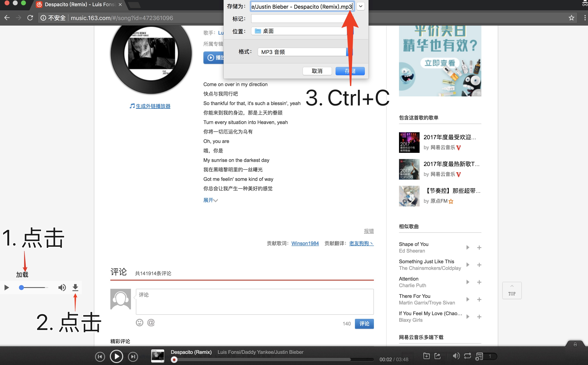

# easy_download

在网易云音乐网页版上加下载按键进行下载歌曲

实现功能:  **点击下载**， **自动复制歌名**

自动复制歌名也就是说，点击下载后，更改歌曲名，直接粘贴即可。

Chrome 上面测试正常。

# 代码逻辑

1.  云音乐页面中插入 a 标签，并有点击事件。
2.  点击后，暂停播放，生成 audio 标签，并复制了歌名。

# 使用方法

1.  [点击](./easyDownload.js) 复制里面的全部 JS 代码。

2.  复制到游览器云音乐界面的开发者工具的 Console 中，回车运行。关闭开发者工具。

3.  打开 Chrome 下载文件前询问，[点击如何打开](https://jingyan.baidu.com/article/6f2f55a14490e2b5b93e6ce4.html)。

4.  播放需要下载的歌，然后点击加载，再点击 audio 的下载图标，粘贴(Ctrl+C)更改名字后下载即可。

具体介绍[点击](https://blog.csdn.net/zwt520123/article/details/80379244)。